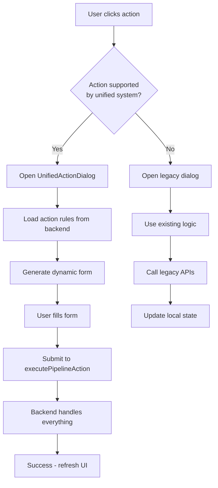
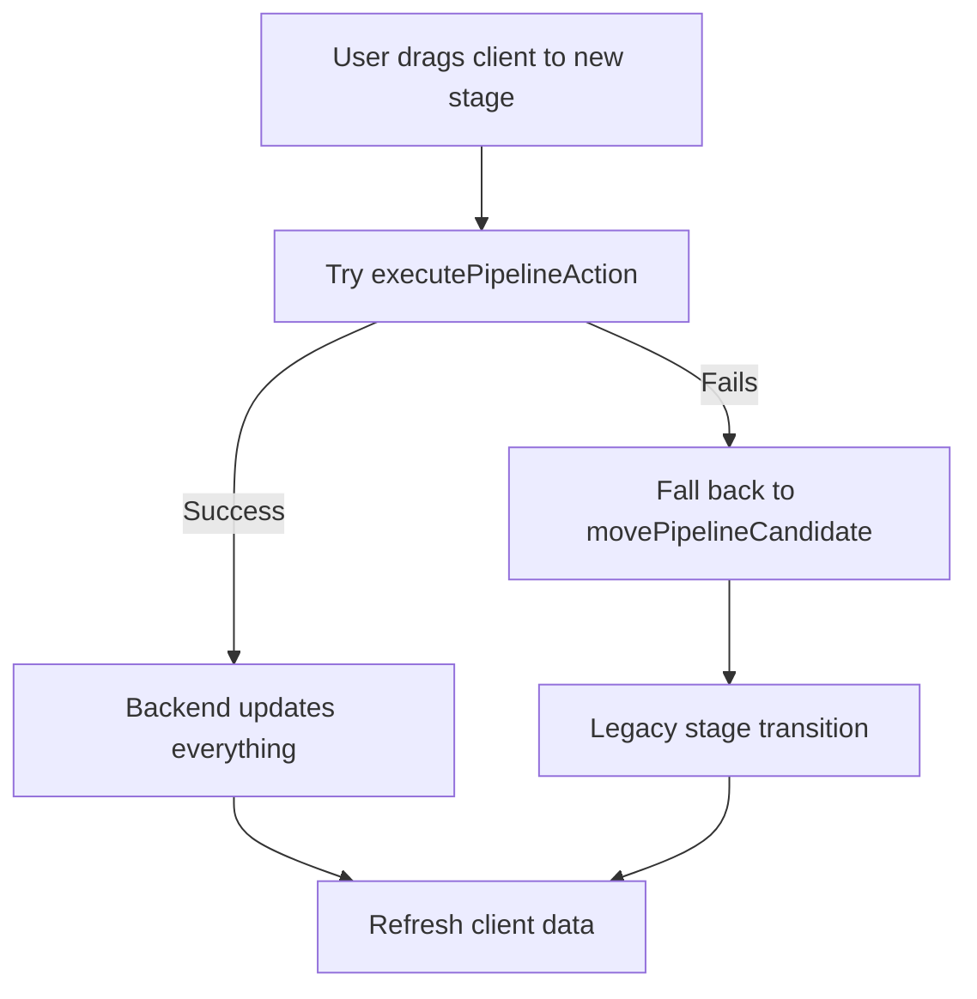

# 🎯 Frontend Migration to Unified Pipeline System

## 📋 **Summary of Changes**

The frontend has been successfully updated to work with the new unified backend pipeline rules system while maintaining backward compatibility with the legacy system.

## 🚀 **Key Features Implemented**

### 1. **Unified API System**

- **Single endpoint**: `executePipelineAction()` handles all actions and stage transitions
- **Dynamic rules**: Backend-driven validation and form requirements
- **Role-based access**: Permissions controlled by backend rules
- **Automatic fallback**: Gracefully falls back to legacy system if unified system is unavailable

### 2. **New Components Created**

#### **UnifiedActionDialog.tsx**

- Dynamic form generation based on backend rules
- Auto-loads action requirements from backend
- Validates required fields, documents, assignments, etc.
- Handles file uploads with document type validation
- Real-time success/error feedback

#### **SystemStatusIndicator.tsx**

- Shows whether unified system is active or in legacy mode
- Allows manual system status refresh
- Visual indicator for system health

### 3. **Enhanced Existing Components**

#### **DraggableClientCard.tsx**

- **Smart action routing**: Automatically uses unified system for supported actions
- **Legacy fallback**: Maintains existing dialogs for unsupported actions
- **Dynamic action loading**: Fetches available actions from backend rules
- **Real-time updates**: Refreshes actions after successful operations

#### **Pipeline.tsx**

- **Unified stage transitions**: Tries unified system first for client moves
- **Enhanced action handling**: Routes through unified system when available
- **System status display**: Shows current system mode in UI
- **Backward compatibility**: Falls back to legacy APIs when needed

## 📁 **Files Modified/Created**

### **New Files:**

```
📄 app/pipelines/components/UnifiedActionDialog.tsx
📄 app/pipelines/components/SystemStatusIndicator.tsx
📄 app/pipelines/README_FRONTEND_MIGRATION.md
```

### **Modified Files:**

```
🔧 app/pipelines/actions/pipelineActions.ts
   ├── + executePipelineAction()
   ├── + getPipelineActionRules()
   ├── + getAvailableActionsForClient()
   ├── + getActionRules()
   └── + Updated usePipelineActions() hook

🔧 app/pipelines/components/DraggableClientCard.tsx
   ├── + Import UnifiedActionDialog
   ├── + Smart action routing logic
   ├── + Dynamic action loading from backend
   └── + Unified action dialog integration

🔧 app/pipelines/components/Pipeline.tsx
   ├── + Import executePipelineAction, SystemStatusIndicator
   ├── + Updated moveClient() with unified system
   ├── + Updated handleActionComplete() with unified system
   └── + Added system status indicator to UI
```

## 🔄 **Migration Strategy**

### **Phase 1: Hybrid System (Current)**

- ✅ Unified system used when available
- ✅ Legacy system as fallback
- ✅ No disruption to existing functionality
- ✅ Gradual user adoption

### **Phase 2: Full Migration (Future)**

- 🔮 Remove legacy API calls
- 🔮 Simplify action handling logic
- 🔮 Remove old dialog components
- 🔮 Clean up constants.ts permission logic

## 🎮 **How It Works**

### **Action Flow:**



### **Stage Transition Flow:**



## 🛡️ **Backward Compatibility**

### **Legacy Systems Still Supported:**

- ✅ Old action dialogs (ActionDialog, ResumeCompletedDialog, etc.)
- ✅ Hard-coded permission checks in constants.ts
- ✅ Legacy API endpoints (completePipelineAction, movePipelineCandidate)
- ✅ Existing file upload workflows

### **Graceful Degradation:**

- ✅ If backend rules API fails → falls back to frontend permissions
- ✅ If unified action API fails → uses legacy action APIs
- ✅ If new dialogs fail → opens old dialogs
- ✅ Visual indicator shows current system mode

## 🔧 **Configuration**

### **Backend Endpoints Used:**

```typescript
GET / api / v1 / pipelines / rules; // Get all action rules
GET / api / v1 / pipelines / rules / { action } / { stage }; // Get specific action rules
GET / api / v1 / pipelines / clients / { id } / available - actions; // Get available actions
POST / api / v1 / pipelines / actions / execute; // Execute any action
```

### **Key Environment Features:**

- **Auto-detection**: System automatically detects unified backend availability
- **Fallback graceful**: No user disruption during backend updates
- **Real-time status**: UI shows current system mode
- **Development friendly**: Console logs show which system is being used

## 🎯 **Benefits**

### **For Users:**

- 🎨 **Better UX**: Dynamic forms that show exactly what's needed
- ⚡ **Faster actions**: Single API call vs multiple calls
- 🔒 **Accurate permissions**: Real-time role-based access control
- 📱 **Consistent UI**: Same experience across all actions

### **For Developers:**

- 🧹 **Cleaner code**: Less hardcoded business logic in frontend
- 🔧 **Easier maintenance**: Rules managed in one place (backend)
- 🚀 **Faster features**: No frontend changes needed for new actions
- 🧪 **Better testing**: Backend rules can be tested independently

### **For System:**

- 📊 **Better audit trail**: All actions tracked in PipelineHistory
- 🔄 **Consistent updates**: All pipeline tables updated atomically
- 📧 **Integrated notifications**: Email/Teams sent automatically
- 📁 **Unified file handling**: SharePoint uploads handled centrally

## 🚨 **Important Notes**

1. **No Breaking Changes**: Existing functionality works exactly the same
2. **Progressive Enhancement**: New features use unified system, old features unchanged
3. **Performance**: Unified system is faster (1 API call vs 3-4 calls)
4. **Monitoring**: System status visible in UI for debugging
5. **Rollback Ready**: Can disable unified system without code changes

## 🎉 **Ready for Production!**

The frontend migration is complete and ready for production use. The system will:

- ✅ Work with current backend (legacy mode)
- ✅ Automatically adopt new unified backend when deployed
- ✅ Maintain all existing functionality
- ✅ Provide enhanced features when unified system is available

**Next Step**: Deploy the backend unified system to see the enhanced features activate! 🚀
